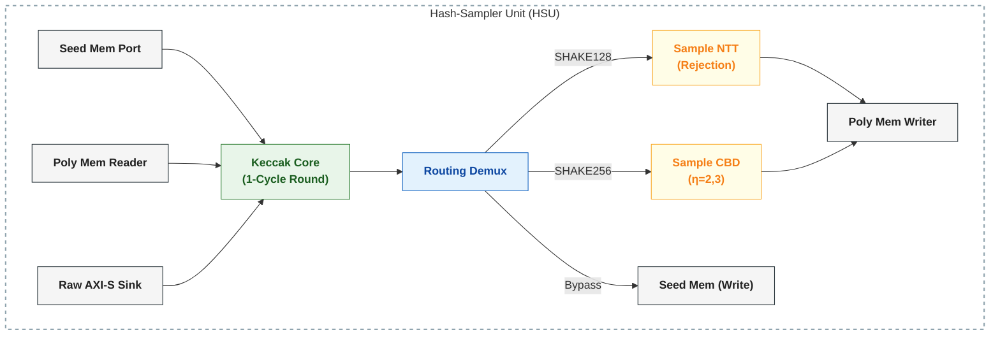

# ML-KEM Hash-Sampler Unit (HSU)

[](https://github.com/QREM-CORE/hash-sampler-unit/actions)
[](https://opensource.org/licenses/MIT)
[](https://nvlpubs.nist.gov/nistpubs/FIPS/NIST.FIPS.203.pdf)

The **Hash-Sampler Unit (HSU)** is a high-performance hardware accelerator core designed to perform the cryptographic hashing and polynomial sampling operations required by **ML-KEM (FIPS 203)**. 

By tightly coupling a **1-cycle-per-round Keccak engine** with specialized **Rejection (NTT)** and **Centered Binomial Distribution (CBD)** samplers, this unit eliminates the need for large intermediate memory buffers and significantly reduces total system latency for matrix and vector generation.

---

## 🏗️ Architecture Overview

The HSU features a dynamic demux/mux routing architecture that allows the Keccak output stream to either feed the samplers directly or bypass them for standard SHA3/SHAKE hashing.



### Key Technical Specs:
- **Keccak Engine**: Fully compliant FIPS 202 permutation core (SHA3-256/512, SHAKE128/256).
- **NTT Sampler**: Hardware-accelerated rejection sampler (Algorithm 7). Produces 256 coefficients indexed by AXI-S `t_last`.
- **CBD Sampler**: Unified η=2/3 sampler (Algorithm 8). Configurable at runtime via `is_eta3_i`.
- **Interface**: Standard AXI4-Stream (64-bit) logic for easy integration into SoC fabrics.
- **Latency Hiding**: Parallelizing Keccak "squeezing" with sampling logic to saturate the output data path.

---

## ⚙️ Operational Modes (`hsu_mode_i`)

The unit assumes one of five primary modes defined in `hash_sample_pkg::hs_mode_t`:

| Enum Name | Keccak Op | Sampler Layer | Security (η) | ML-KEM Operation |
| :--- | :--- | :--- | :--- | :--- |
| `MODE_SAMPLE_NTT` | SHAKE128 | Seed Mem | Rejection | **Matrix A** Generation |
| `MODE_SAMPLE_CBD` | SHAKE256 | Seed Mem | CBD | **s, e, e1, e2** Generation |
| `MODE_HASH_SHA3_256` | SHA3-256 | Seed Mem / Raw AXI | Bypass | Hash functions **H(p, m, c)** |
| `MODE_HASH_SHA3_512` | SHA3-512 | Seed Mem / Raw AXI | Bypass | Hash functions **G(d, m, h)** |
| `MODE_HASH_SHAKE256` | SHAKE256 | Seed Mem / Raw AXI | Bypass | Function **J(z, c)** |

> [!NOTE]
> Sampler outputs are 48-bit (4 x 12-bit coeffs) which are zero-padded to 64-bit `t_data_o`: `{16'b0, data[47:0]}`.

---

## 📟 Interface Description

### Control & Status
- **`start_i`**: Pulse (1 cycle) to begin a hashing/sampling operation.
- **`hsu_mode_i`**: Selects routing and hashing parameters. Must be stable on `start_i`.
- **`input_sel_i`**: Selects Keccak input source (0 = Seed Mem, 1 = Poly Mem Reader, 2 = Raw AXI-S).
- **`absorb_poly_i`**: Pulse once per poly to absorb via packer. Wait for `packer_done_o`.
- **`absorb_last_i`**: Must be high on the last absorption segment before Keccak squeezes.
- **`is_eta3_i`**: (CBD Only) Set to `1` for ML-KEM-768/1024, `0` for ML-KEM-512.
- **`xof_len_i`**: Defines total output bytes for SHAKE modes.
- **Metadata**: `poly_id_i`, `seed_id_i`, `row_i`, `col_i`, `cbd_n_i`.
- **`hsu_done_o`**: Sticky completion signal. Latches high when operation is fully complete.
- **`packer_done_o`**: Asserts when poly reader packer finishes draining its gearbox buffer.

### Memory & Data Ports
| Interface | Type | Key Signals | Description |
| :--- | :--- | :--- | :--- |
| **Poly Mem Writer** | Output | `hsu_req_o`, `hsu_wr_data_o`, `hsu_wr_en_o` | High-throughput sampler output port (NTT/CBD) |
| **Poly Mem Reader** | Input | `hsu_rd_data_i`, `hsu_rd_valid_i` | Source for multi-phase polynomial absorption |
| **Seed Mem Port** | Bidir | `hsu_seed_wdata_o`, `hsu_seed_rdata_i` | Source for seed injection and sink for bypass hashes |
| **Raw AXI-S Input** | Sink | `axis_t_data_i`, `axis_t_valid_i`, `axis_t_last_i` | Direct feed to Keccak for bypass operations |

---

## 🚀 Getting Started

### Prerequisites
- SystemVerilog compatible simulator (Verilator 5.0+, ModelSim, Vivado).
- Python 3.x for test vector generation.

### Installation
```bash
# Clone recursively to include Keccak and Sampler submodules
git clone --recursive https://github.com/QREM-CORE/hash-sampler-unit.git
cd hash-sampler-unit
```

### Verification
The verification suite uses a Python-driven flow to generate vectors and run the SystemVerilog testbench.

```bash
# Generate test vectors and run all testcases in Verilator
make run_hash_sampler_unit_tb SIM=verilator

# To run with ModelSim
make run_hash_sampler_unit_tb SIM=modelsim
```

---

## 📦 Submodules
This project integrates high-performance cores from the **QREM-CORE** library:
*   [keccak-fips202-sv](https://github.com/QREM-CORE/keccak-fips202-sv): 1-cycle-per-round Keccak core.
*   [poly-samplers](https://github.com/QREM-CORE/poly-samplers): High-throughput CBD and NTT sampling units.

---

## 📄 License
This project is licensed under the MIT License - see the [LICENSE](LICENSE) file for details.
